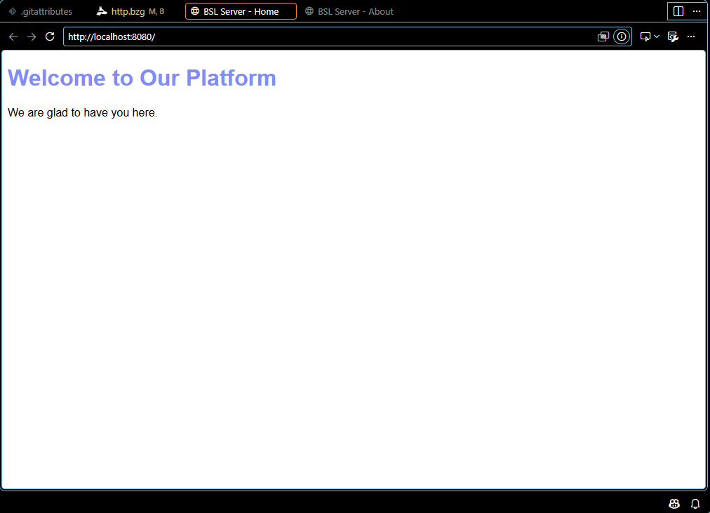
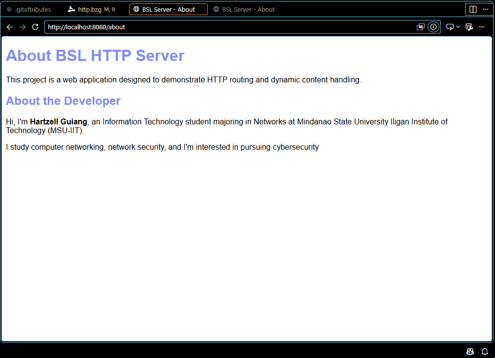
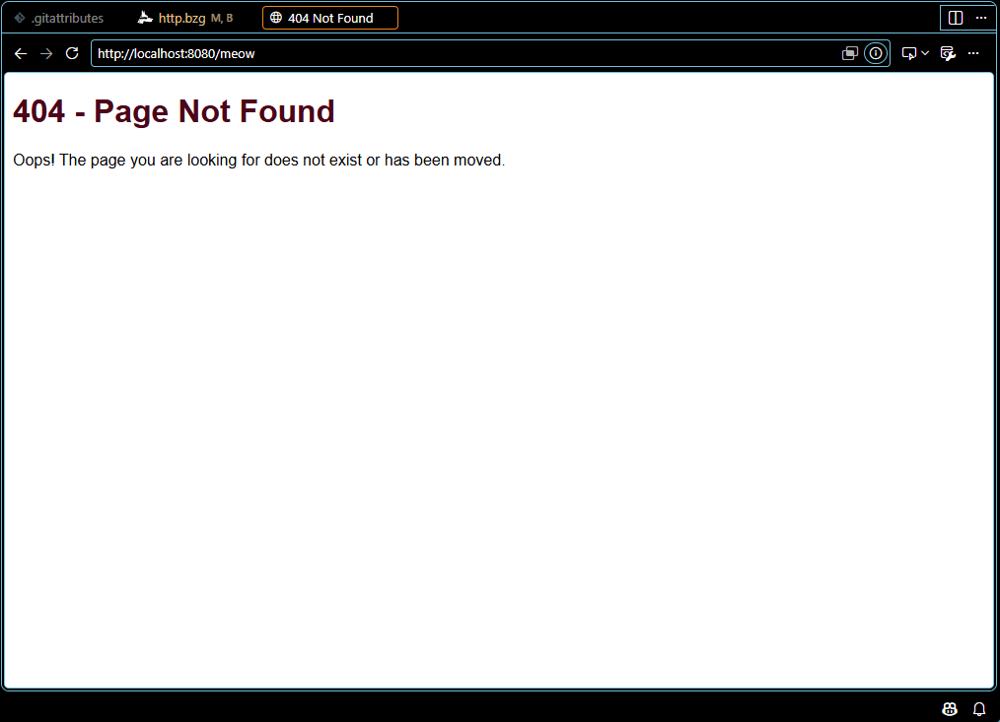
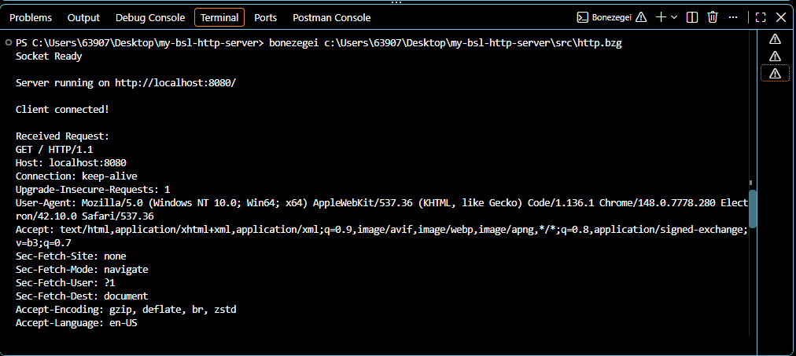

# my-bsl-http-server

## Project Description

This application is a custom HTTP web server built from scratch using the Bonezegei Scripting Language (BSL) and its native socket networking library for Lab 1: Building an HTTP Server using Socket. Rather than relying on high-level web frameworks, the server manually manages low-level socket operations—opening a socket, binding to a local port, listening for incoming TCP client connections, reading raw HTTP request strings, parsing the request path, and returning structured HTTP/1.1 response headers along with HTML body payloads.

The server runs on port `8080` and handles three primary routing scenarios:
- `/` — Default landing page welcoming the user.
- `/about` — About page containing details about the project and developer.
- Any other path (e.g., `/home`, `/user`, `/anything`) — Custom 404 Not Found error page.

---

## Installation & Setup Guide

### 1. System Requirements & Prerequisites
* **Supported OS:** Windows (x64), Linux (x64), or macOS/Android (via GitHub Codespaces Linux container).
* **Code Editor:** Visual Studio Code (recommended).
* **Git:** Installed on your system to clone the repository.


### 2. Installing BSL (Bonezegei Scripting Language) Interpreter

1. Open **VS Code**.
2. Press `Ctrl + Shift + X` (or `Cmd + Shift + X` on macOS) to open the **Extensions** marketplace.
3. Search for `"Bonezegei"` and locate **Bonezegei Scripting Language Formatter**.
4. Click **Install**.
5. Open the extension details page in VS Code and follow the OS-specific installer steps provided in its documentation to install the core `bonezegei` / `bzg` interpreter binary into your system environment path.


### 3. Installing the BSL Socket Library
The HTTP server requires the official Bonezegei socket library (socket) to manage network bindings, incoming TCP connections, and data streams.

Using the BSL Package Manager (CLI)
Execute the following command inside your project directory to download and install the socket library directly:

```bash
    bzg install socket
```

Verifying Socket Installation
Ensure the socket library binary or script module is properly indexed in your system's BSL module path so the #import "socket" directive resolves without errors when running the script.

Running the HTTP Server
Launch the server script using the BSL interpreter:

```bash
    bonezegei src/http.bzg
```

Check your terminal output. When properly started, it will output:

Plaintext
Socket Ready
Server running on http://localhost:8080/

Keep the terminal running to maintain the live server connection.

---

## Usage Instructions
With the server actively running, open any modern web browser and test the following endpoints:

**Default Landing Page:**

Navigate to http://localhost:8080/

Response: Returns an HTTP/1.1 200 OK header and renders the main welcome page HTML body.

**About Page:**

Navigate to http://localhost:8080/about

Response: Returns an HTTP/1.1 200 OK header and renders the project and developer information HTML body.

**404 Not Found Page:**

Navigate to any unmapped path such as http://localhost:8080/anything, http://localhost:8080/home, or http://localhost:8080/user

Response: Returns an HTTP/1.1 404 Not Found header and renders the custom error page HTML body.

---

## Screenshots Section
Screenshots are in the `documentation` folder.
 
**/ route**

 
**/ about route**

 
**Unknown route (404 page)**

 
**Terminal running the server**
